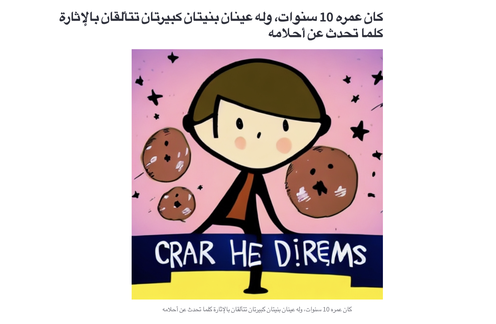

# 🌟 Imagine Your Future 🌟

Welcome to Imagine Your Future – an innovative and creative app that lets you visualize your dreams! 🎉

## 🚀 What Does This App Do?

This app is designed to help you imagine your future in a fun and engaging way. Here's how it works:

Generate Inspiring Stories: Enter your name, age, dream, and country, and the app will create a positive and realistic story about your future.

Create Stunning Images: For every sentence in your story, we generate a beautiful illustration that brings your dream to life!

Display in Arabic: While the app operates in English, it's tailored for Arabic-speaking users. It translates the generated stories and images into Arabic, providing an immersive experience.

## 📚 Here you can see some sample stories:
<p align="center">
  
  
  
</p>

<p align="center">
  
  
  
</p>


## 🎨 How It Works

**Story Generation:** The app uses a powerful AI model to craft a story based on your input. It ensures that the story is not only imaginative but also aligned with your aspirations.

**Image Generation:** Using state-of-the-art image generation techniques, the app creates visual representations of your story. Each image is designed to match the narrative perfectly.

**Arabic Integration:** The app seamlessly translates the generated content into Arabic, ensuring the final output resonates with native speakers.

## 💻 Tech Stack

**Backend:** Built with FastAPI for efficient and fast server-side operations.

**AI Models:** Utilizes advanced AI models for both story generation and image creation.

**Translation:** Powered by deep-translator to translate between English and Arabic.

**Frontend:** Streamlit for an interactive and user-friendly interface.

## 🎉 Features
**Customizable Input:** Tailor the story by providing your unique details.

**Dual-Language Support:** Generate content in English and display it in Arabic.

**Visual Storytelling:** See your story come to life with generated images.

## 📜 How to Run

Clone this repository.
Install the necessary dependencies using 
```sh
pip install -r requirements.txt.
```
Run the FastAPI server for story and image generation.
Launch the Streamlit app to interact with the service.

## 🎈 Why This App?
This app was created with a focus on Arabic-speaking users who want to imagine and visualize their future in a language they love. Whether you're dreaming of becoming a doctor, an engineer, or anything else, this app is here to inspire you and help you see the possibilities! its specially for kids to play with and have fun imagining the positive future.
